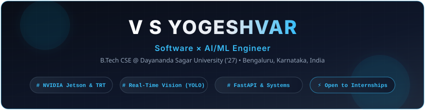

<div align="center">

  

  <br /><br />

  <a href="https://git.io/typing-svg">
    
  </a>

  <br /><br />

  <p align="center">
    <a href="https://github.com/Yogeshvar425?tab=followers">
      
    </a>
    <a href="https://github.com/Yogeshvar425">
      
    </a>
  </p>

</div>

---

###  Executive Summary

```yaml
candidate:
  name: V S Yogeshvar
  role: Computer Science Undergraduate | Edge AI & Systems Developer
  institution: Dayananda Sagar University, Bengaluru (B.Tech CSE '27 | CGPA: 7.84)
  location: Bengaluru, Karnataka, India
  contact: vsyogeshvar425@gmail.com

technical_ethos:
  focus: Designing and optimizing high-throughput, low-latency AI pipelines on resource-constrained edge devices.
  competency: "Bridging deep learning inference optimization (TensorRT, INT8/FP16) with robust production microservices."
```

Computer Science undergraduate with hands-on experience building and optimizing **real-time AI systems on embedded NVIDIA Jetson hardware**. Strong foundation in Python, Java, Data Structures & Algorithms, and practical mastery of **TensorRT optimization**, computer vision architectures, and modular software design.

---

###  Featured Engineering Projects

<table>
  <tr>
    <td width="50%" valign="top">
      <h4> Sentinel Surveillance — Edge AI & CV System</h4>
      <p><i>Aug 2025 – Apr 2026 • NVIDIA Jetson, TensorRT, YOLOv8n, ByteTrack, FaceNet512, llama.cpp, Flask</i></p>
      <ul>
        <li><b>Edge Pipeline:</b> Engineered a modular real-time vision system on <b>NVIDIA Jetson</b> hardware achieving <b>28 FPS</b> with concurrent object detection, tracking, and facial recognition.</li>
        <li><b>TensorRT Optimization:</b> Quantized deep-learning models to <b>FP16</b> via TensorRT, slashing inference latency by <b>~65% (120 ms &rarr; 35–45 ms)</b> for real-time edge execution.</li>
        <li><b>Local VLM:</b> Integrated an on-device Vision-Language Model via <code>llama.cpp</code> for structured JSON scene intelligence with zero cloud latency or API dependence.</li>
        <li><b>Live Dashboard:</b> Built a Flask monitoring console for real-time video feeds, event telemetry, and hardware health metrics.</li>
      </ul>
    </td>
    <td width="50%" valign="top">
      <h4> TrueSentiment — NLP Pipeline & REST API</h4>
      <p><i>Aug 2024 – Mar 2025 • Python, NLP, Scikit-learn, TF-IDF, SVM, FastAPI, REST API</i></p>
      <ul>
        <li><b>End-to-End NLP Ingestion:</b> Built an automated data collection pipeline via YouTube Data API with automated spam/bot filtration and text preprocessing.</li>
        <li><b>Model Training:</b> Trained and tuned Logistic Regression and SVM models using TF-IDF bigram features; validated via 5-fold stratified cross-validation achieving <b>~76% accuracy</b> on noisy real-world data.</li>
        <li><b>High-Speed Microservice:</b> Deployed as a scalable <b>FastAPI REST API</b> delivering <b>&lt;50 ms</b> inference response latency.</li>
        <li><b>Telemetry Dashboard:</b> Created a live HTML5 Canvas dashboard for monitoring queue throughput and server health.</li>
      </ul>
    </td>
  </tr>
</table>

---

###  Technical Skills & Toolchain

<div align="center">

  <p><b>Core Languages</b></p>
  <a href="https://skillicons.dev">
    
  </a>

  <br /><br />

  <p><b>AI, Vision & Edge Acceleration</b></p>
  <a href="https://skillicons.dev">
    
  </a>

</div>

<br />

<details>
  <summary><b> Detailed Competency Matrix</b></summary>
  <br />

  | Domain | Technologies & Frameworks |
  | :--- | :--- |
  | **Edge AI & Embedded Systems** | NVIDIA Jetson, TensorRT (FP16/INT8), YOLOv8n, ByteTrack, FaceNet512, llama.cpp (Local LLM/VLM) |
  | **Machine Learning & NLP** | Scikit-learn, PyTorch, OpenCV, TF-IDF, SVM, Logistic Regression, Feature Engineering |
  | **Backend & Microservices** | FastAPI, Flask, RESTful APIs, Automated Data Pipelines, JSON Schemas |
  | **Programming Languages** | Python, Java, C, C++, SQL (DBMS), JavaScript |
  | **Core Fundamentals** | Data Structures & Algorithms, Operating Systems, Computer Networks, OOP |
  | **Developer Tooling** | Linux (Ubuntu/POSIX), Git, GitHub, VS Code, Bash Scripting |

</details>

---

###  Verified Certifications

-  **Intro to Transformer-Based NLP** — *NVIDIA*
-  **Networking Fundamentals** — *Infosys Springboard*

---

###  GitHub Analytics & Metrics

<div align="center">
  <table border="0">
    <tr>
      <td align="center">
        
      </td>
      <td align="center">
        
      </td>
    </tr>
  </table>

  
</div>

---

###  Connect & Contact

<div align="center">
  <a href="mailto:vsyogeshvar425@gmail.com">
    
  </a>
  <a href="https://linkedin.com/in/" target="_blank">
    
  </a>
  <a href="https://github.com/Yogeshvar425" target="_blank">
    
  </a>
</div>

<br />

<div align="center">
  
</div>
